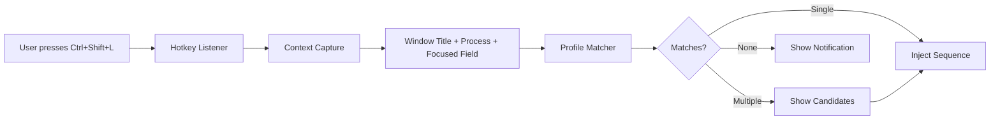

# APM Autofill on Windows

APM autofill is a **Windows-only daemon** that provides system-wide credential injection without a browser extension. It detects active window context, matches credentials from your vault, and injects keystrokes via a global hotkey.

---

## Architecture Overview



The daemon is a local HTTP server running on a loopback address with bearer-token authentication. It captures active window context using Windows UI Automation APIs and matches against autofill profiles derived from your vault entries.

---

## Getting Started

### Enable Autofill (Recommended)

```bash
pm autocomplete enable
```

This does two things:

1. **Registers autostart** — The daemon launches automatically when you log in
2. **Starts the daemon** — Begins running immediately

### Manual Control

```bash
pm autocomplete start    # Start the daemon manually
pm autocomplete stop     # Stop the daemon
pm autocomplete status   # Check daemon state + autostart status
pm autocomplete disable  # Remove autostart registration
```

### Alternative Commands

```bash
pm autofill start        # Start with default settings
pm autofill stop         # Stop the daemon
pm autofill status       # Show daemon status
pm autofill list-profiles  # Show all autofill profiles
```

---

## Unlocking the Daemon

The daemon starts in a **locked state** and rejects all fill requests until unlocked:

```bash
pm unlock
```

This unlocks both the CLI session **and** the autofill daemon. The daemon decrypts the vault in memory and holds it for the session duration.

To lock:

```bash
pm lock
```

This locks both the CLI session and wipes the daemon's in-memory vault data.

!!! warning
    The daemon holds decrypted data in memory while unlocked. Always lock when stepping away from your machine.

---

## Hotkey

**Default:** ++ctrl+shift+l++

You can customize the hotkey when starting the daemon:

```bash
pm autofill start --hotkey "ctrl+alt+p"
```

When pressed, the daemon:

1. Captures the current window context (title, process name, focused field)
2. Searches for matching autofill profiles
3. If a single match is found, injects the keystroke sequence
4. If multiple matches are found, shows a selection notification

---

## Autofill Profiles

Profiles are derived from your vault's password entries. Each profile maps a credential to context matchers:

| Field             | Description                                |
| :---------------- | :----------------------------------------- |
| `service`         | Display name (from vault account name)     |
| `domain`          | Primary domain for browser matching        |
| `domains`         | Additional domains                         |
| `entry_account`   | Vault entry account name                   |
| `entry_username`  | Username to inject                         |
| `totp_account`    | Linked TOTP entry for 2FA                  |
| `process_names`   | Process name matchers (e.g., `chrome.exe`) |
| `window_contains` | Window title substring matchers            |
| `sequence`        | Custom injection sequence template         |

View all profiles:

```bash
pm autofill list-profiles
```

---

## Fill Sequences

The default injection sequence is:

```
{USERNAME}{TAB}{PASSWORD}{ENTER}
```

This types the username, presses Tab to move to the password field, types the password, and presses Enter.

You can customize sequences per profile. Available tokens:

| Token        | Action                     |
| :----------- | :------------------------- |
| `{USERNAME}` | Types the username         |
| `{PASSWORD}` | Types the password         |
| `{TOTP}`     | Types the linked TOTP code |
| `{TAB}`      | Presses the Tab key        |
| `{ENTER}`    | Presses Enter              |
| `{DELAY:N}`  | Waits N milliseconds       |

---

## Context Detection

The daemon uses multiple signals to detect credential-like contexts:

1. **Window title** — Checks for keywords like "login", "sign in", "password", "credentials"
2. **Process name** — Identifies browsers and common applications
3. **Focused field** — Uses UI Automation to detect password-type input fields
4. **Domain extraction** — Parses browser window titles for URLs

### Popup Hints

When the daemon detects a credential-like context (even without a hotkey press), it can show a **popup notification** suggesting that a match is available.

```bash
pm autocomplete window enable   # Enable popup hints
pm autocomplete window disable  # Disable popup hints
pm autocomplete window status   # Check hint status
```

---

## TOTP Linking

Link an existing TOTP entry to a domain so autofill can include the 2FA code:

```bash
pm autocomplete link-totp
```

This interactive command lets you:

1. Select a TOTP entry from your vault
2. Specify the domain or service it belongs to
3. APM then includes the TOTP code in fill requests for that domain

---

## Security Model

| Property            | Implementation                             |
| :------------------ | :----------------------------------------- |
| **Network scope**   | Loopback only (127.0.0.1)                  |
| **Authentication**  | Bearer token generated at startup          |
| **Vault state**     | Held in memory only; wiped on lock/stop    |
| **Clipboard**       | Not used for core typing flows             |
| **Session timeout** | Configurable expiry + inactivity lockout   |
| **IPC**             | Local HTTP on random port, token-protected |

!!! info "No Clipboard"
    APM autofill injects keystrokes directly without using the clipboard. This prevents clipboard-monitoring malware from intercepting your credentials. The clipboard is only used when you explicitly copy via `pm get` or the ++c++ key in the interactive browser.

---

## Troubleshooting

### Daemon won't start

- Check if another instance is already running: `pm autofill status`
- Ensure no other application is using the daemon's port

### Hotkey doesn't work

- Make sure the daemon is running and unlocked
- Check if another application has claimed the same hotkey combination
- Try a different hotkey: `pm autofill start --hotkey "ctrl+alt+p"`

### No match found

- Verify the entry exists in your vault: `pm get [service]`
- Check profiles: `pm autofill list-profiles`
- Ensure the window title or domain matches a profile's matchers

---

## Next Steps

- **[TOTP Guide](guides/totp.md)** — Managing 2FA codes
- **[Sessions](guides/sessions.md)** — Session lifecycle and the daemon