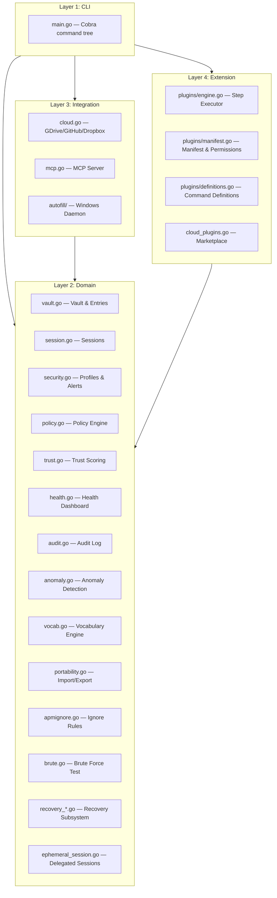
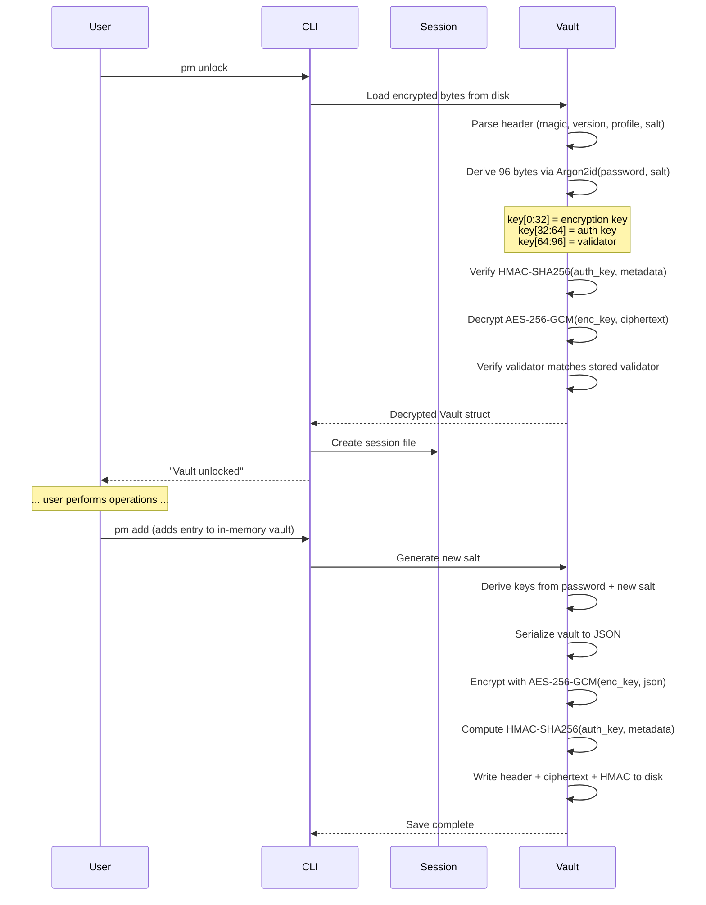

# Architecture

APM is structured as a **four-layer architecture** that separates concerns between user interaction, domain logic, external integrations, and extensibility.

---

## Layer Diagram

---

## Layer 1: CLI

**File:** `main.go` (~3,600 lines)

The CLI layer uses [Cobra](https://github.com/spf13/cobra) to define the entire command tree. It handles:

- User input parsing and validation
- Interactive prompts (password input, menus, confirmations)
- Output formatting (colored terminal output via `fatih/color`)
- Delegation to domain and integration layers

### Key Design Decisions

- **Single binary** — All commands live in one file for straightforward distribution
- **Interactive by default** — Most commands use interactive prompts rather than requiring flags
- **Explicit session checks** — Every sensitive command verifies an active session before proceeding

---

## Layer 2: Domain

**Directory:** `src/`

The domain layer contains all business logic. It operates entirely in memory after vault decryption:

| File                   | Responsibility                                   |
| :--------------------- | :----------------------------------------------- |
| `vault.go`             | Vault struct, entry types, encrypt/decrypt logic |
| `session.go`           | Shell-scoped session management                  |
| `ephemeral_session.go` | Delegated sessions with host/PID/agent binding   |
| `security.go`          | Profile management, alerts, email masking        |
| `policy.go`            | YAML policy loading and enforcement              |
| `trust.go`             | Per-secret trust scoring (telemetry + risk)      |
| `health.go`            | Vault health scoring algorithm                   |
| `audit.go`             | Tamper-evident audit logging                     |
| `anomaly.go`           | Unusual activity time detection                  |
| `vocab.go`             | Note vocabulary with aliases and scoring         |
| `portability.go`       | JSON, CSV, TXT import/export                     |
| `apmignore.go`         | Ignore rule parsing and filtering                |
| `brute.go`             | Brute-force test engine                          |
| `recovery_passkey.go`  | WebAuthn passkey recovery                        |
| `quorum_recovery.go`   | Shamir secret sharing (quorum recovery)          |
| `recovery_codes.go`    | One-time recovery codes                          |

---

## Layer 3: Integration

| Component  | File(s)         | Protocol            | Purpose                     |
| :--------- | :-------------- | :------------------ | :-------------------------- |
| Cloud Sync | `cloud.go`      | REST / OAuth2 / PAT | Multi-provider vault sync   |
| MCP Server | `mcp.go`        | stdio (JSON-RPC)    | AI assistant vault access   |
| Autofill   | `autofill/*.go` | HTTP (loopback)     | Windows keystroke injection |

### Cloud Provider Architecture

Each cloud provider follows the same interface:

1. **Init** → Configure OAuth/PAT credentials
2. **Sync** → Upload encrypted vault blob
3. **Get** → Download remote vault blob
4. **Reset** → Clear provider configuration

Credentials are stored encrypted inside the vault itself.

### MCP Server Architecture

The MCP server is spawned as a subprocess by AI clients. It:

1. Accepts stdio transport
2. Validates bearer tokens against the vault's token store
3. Routes tool calls to domain layer (vault read/write)
4. Enforces permission scope checks per tool
5. Manages transaction state for write operations

### Autofill Architecture

The autofill daemon is a local HTTP server that:

1. Listens on a random port on loopback
2. Stores a shared bearer token for IPC
3. Captures active window context via Windows APIs
4. Matches credentials against vault profiles
5. Injects keystrokes via `SendInput` (Windows)

---

## Layer 4: Extension

| Component   | File(s)                  | Purpose                           |
| :---------- | :----------------------- | :-------------------------------- |
| Engine      | `plugins/engine.go`      | Executes plugin step pipelines    |
| Manifest    | `plugins/manifest.go`    | Validates plugin.json schemas     |
| Definitions | `plugins/definitions.go` | Built-in step command definitions |
| Marketplace | `cloud_plugins.go`       | Cloud-backed plugin distribution  |

---

## Data Flow: Vault Unlock → Save

---

## Security Boundaries

| Boundary         | Inside                          | Outside                  |
| :--------------- | :------------------------------ | :----------------------- |
| Vault encryption | All entry data, credentials     | Master password, keys    |
| Session boundary | Decrypted vault (in memory)     | Persisted data (on disk) |
| Cloud boundary   | Encrypted blob (APMVAULT)       | Plaintext entries        |
| MCP boundary     | Permitted data (per scope)      | Unauthorized data        |
| Plugin boundary  | Permitted operations (per perm) | Unauthorized operations  |

---

## Next Steps

- **[Encryption](encryption.md)** — Detailed cryptographic design
- **[Vault Format](vault-format.md)** — Binary format specification