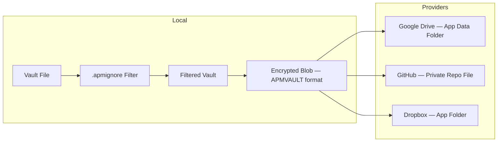
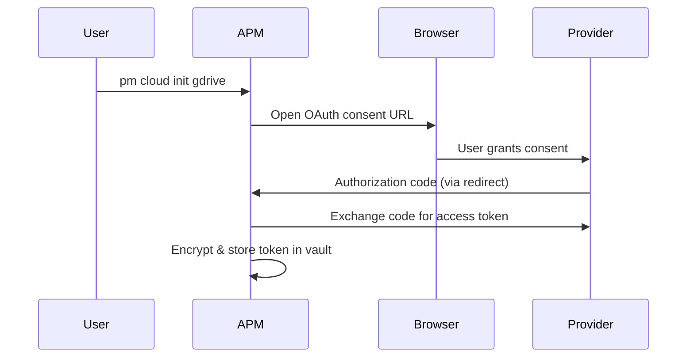
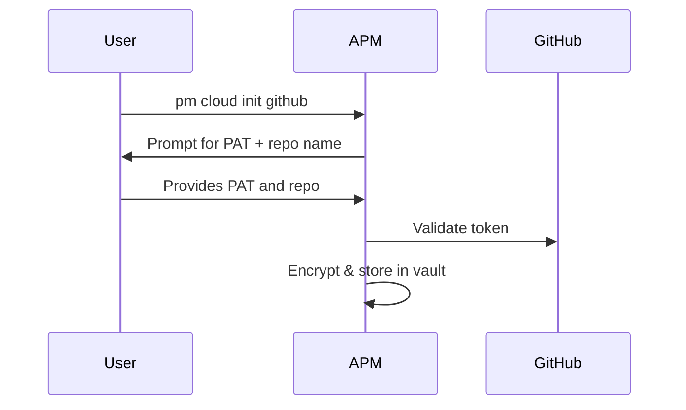

# Cloud Synchronization

APM synchronizes encrypted vaults across devices using cloud storage providers. This page covers the technical design, provider differences, and security guarantees.

---

## Architecture

The sync process:

1. Load `.apmignore` rules
2. Create a filtered copy of the vault (in memory)
3. Encrypt the filtered vault using the same APMVAULT format
4. Upload the encrypted blob to the configured provider(s)

---

## Provider Comparison

| Aspect              | Google Drive            | GitHub                        | Dropbox                     |
| :------------------ | :---------------------- | :---------------------------- | :-------------------------- |
| **Auth**            | OAuth2/PKCE             | Personal Access Token         | OAuth2/PKCE                 |
| **Storage**         | App Data Folder         | File in private repo          | App Folder                  |
| **Isolation**       | Hidden from Drive UI    | Visible in repo               | Visible in app folder       |
| **Version History** | Provider-managed        | Git commits — full history    | Provider-managed            |
| **Token Storage**   | Encrypted in vault      | Encrypted in vault            | Encrypted in vault          |
| **Library**         | `google.golang.org/api` | `github.com/google/go-github` | `dropbox-sdk-go-unofficial` |

---

## Authentication Flows

### OAuth2/PKCE (Google Drive & Dropbox)

### Personal Access Token (GitHub)

---

## Retrieval Keys

When uploading a vault, APM generates a **retrieval key** — a unique identifier that helps locate the vault on the provider.

### Metadata Consent

For providers that support metadata (Google Drive, Dropbox), APM asks for explicit consent before storing a hash of the retrieval key:

- **Consent given** — A one-way hash of the retrieval key is stored in provider metadata, enabling lookup
- **Consent denied** — The vault is identified only by provider-specific IDs (file ID or path)

This ensures no identifying information is stored without explicit user approval.

---

## Security Guarantees

### What's Encrypted

The uploaded blob is the **exact same APMVAULT format** stored on disk:

- `APMVAULT` header (magic, version, profile, salt, validator)
- AEAD-encrypted payload (`aes-gcm` or `xchacha20-poly1305`, depending on the vault profile)
- HMAC-SHA256 integrity signature

### What's Not Uploaded

- Master password
- Decrypted entries
- Session data
- Audit logs
- Ephemeral session tokens

### Cloud Token Storage

Provider credentials (OAuth tokens, PATs) are stored **encrypted inside the vault**. They're accessible only when the vault is unlocked, and they're synced across devices automatically (unless filtered by `.apmignore`).

---

## Conflict Resolution

When downloading a remote vault that differs from the local copy:

| Strategy           | Behavior                                         |
| :----------------- | :----------------------------------------------- |
| Overwrite local    | Remote vault replaces local vault entirely       |
| Keep conflict copy | Remote vault saved as timestamped file alongside |
| Cancel             | No changes made                                  |

!!! info "No Entry-Level Merge"
    APM operates on whole-vault sync — it does not merge individual entries. This is by design: merging encrypted data safely would require leaking metadata about vault contents to detect conflicts.

---

## Next Steps

- **[Cloud Sync Guide](../guides/cloud-sync.md)** — Practical setup and usage
- **[Using .apmignore](../guides/apmignore.md)** — Controlling upload filters
