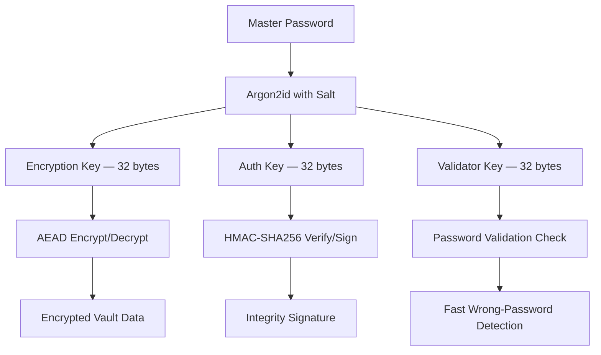

# Encryption

APM uses a **zero-knowledge model** with encrypted-at-rest storage and authenticated encryption. Your master password never leaves your machine — it's used locally to derive multiple cryptographic keys that protect every aspect of the vault.

---

## Key Derivation

### Argon2id

APM uses **Argon2id** — the winner of the Password Hashing Competition — to derive encryption keys from your master password:

```
master_password + salt → Argon2id → 96 bytes of key material
```

The 96-byte output is split into three distinct keys:

| Bytes | Key Name           | Purpose                                        |
| :---- | :----------------- | :--------------------------------------------- |
| 0–31  | **Encryption Key** | Vault payload and DEK-slot AEAD encryption     |
| 32–63 | **Auth Key**       | HMAC-SHA256 integrity verification             |
| 64–95 | **Validator Key**  | Password correctness check before full decrypt |

### Why Three Keys?

A single Argon2id invocation produces all three keys, but each serves a distinct security purpose:

1. **Encryption Key** — Used only for the selected AEAD encrypt/decrypt path. Never exposed or stored.
2. **Auth Key** — Used to compute an HMAC signature over vault metadata. Verifies that the vault hasn't been tampered with before attempting decryption.
3. **Validator Key** — A hash of this key is stored in the vault header. APM checks it immediately after key derivation to confirm the correct password was entered, before attempting the expensive decryption step.

### Argon2id Parameters by Profile

| Profile      | Memory Cost | Time Cost | Parallelism | Salt Size |
| :----------- | :---------- | :-------- | :---------- | :-------- |
| **Standard** | 64 MB       | 3         | 2           | 16 bytes  |
| **Hardened** | 256 MB      | 5         | 4           | 32 bytes  |
| **Paranoid** | 512 MB      | 6         | 4           | 32 bytes  |
| **Legacy**   | PBKDF2      | 600,000   | 1           | 16 bytes  |

Each profile makes a deliberate trade-off between performance and brute-force resistance:

- **Standard** is suitable for most machines and resists commodity GPU attacks
- **Hardened** pushes memory requirements high enough to make ASIC/FPGA attacks impractical
- **Paranoid** is designed for servers and high-security environments
- **Legacy** uses PBKDF2 for backward compatibility only

---

## Encryption

### AEAD Cipher Selection

APM encrypts the serialized vault JSON with an AEAD cipher selected by the active profile. Built-in profiles currently default to `aes-gcm`, and custom profiles can switch to `xchacha20-poly1305`.

### AES-256-GCM

`aes-gcm` is the default compatibility path:

```
encryption_key + nonce + plaintext_json → AES-256-GCM → ciphertext
```

### XChaCha20-Poly1305

`xchacha20-poly1305` is also supported for vault payloads and DEK slots:

```
encryption_key + nonce(24 bytes) + plaintext_json → XChaCha20-Poly1305 → ciphertext
```

Both modes provide:

- **Confidentiality** — The ciphertext reveals nothing about the plaintext
- **Integrity** — Built-in authentication tag detects any modification
- **Non-malleability** — Attackers cannot produce valid ciphertext without the key

### Nonce Handling

A fresh **random nonce** is generated for every save operation. The nonce is stored in the vault header area and is not secret — its purpose is to ensure that encrypting the same vault twice produces different ciphertext.

!!! info "Nonce Reuse Protection"
    APM rotates both the salt and the nonce on every save. That means the derived keys change each time, and the selected AEAD also gets a fresh nonce for the new ciphertext.

---

## Double-Layer Integrity

APM provides **two independent integrity checks**:

### Layer 1: AEAD Authentication Tag

Both supported AEAD modes include an authentication tag that's verified during decryption. If any byte of the ciphertext is modified, decryption fails immediately.

### Layer 2: HMAC-SHA256 Signature

An HMAC-SHA256 signature is computed over vault metadata using the 32-byte authentication key:

```
auth_key + vault_metadata → HMAC-SHA256 → 32-byte signature
```

This signature is stored in the vault file and verified **before** decryption. It provides:

- **Pre-decryption tamper detection** — APM detects modification before attempting the expensive decrypt step
- **Metadata protection** — Covers the vault header, profile, and salt information that are stored unencrypted

---

## Password Validation

Before decrypting the vault, APM performs a **fast password check**:

1. Derive the validator key (bytes 64–95 of Argon2id output)
2. Hash the validator key with SHA-256
3. Compare against the stored validator bytes in the vault header

This catches wrong passwords in milliseconds rather than waiting for a full GCM decryption failure. It's a UX optimization — not a security boundary (GCM still validates independently).

---

## Data Encryption Key (DEK) Slot

For account recovery, APM supports a **DEK slot**:

```
master_password → Argon2id → encryption_key → encrypts vault
recovery_key   → Argon2id → recovery_enc_key → encrypts DEK_slot(encryption_key)
```

The DEK slot stores the vault's encryption key, encrypted under the recovery key. This allows vault re-encryption during recovery without ever exposing the original master password:

1. User provides recovery key
2. APM decrypts the DEK slot to obtain the encryption key
3. Vault is decrypted using the recovered encryption key
4. User sets a new master password
5. Vault is re-encrypted with new keys

!!! tip "Zero-Knowledge Preserved"
    The recovery key never needs to be stored on any server. It's generated locally and must be stored securely by the user.

---

## Data Encryption (Standalone)

APM provides standalone `EncryptData` and `DecryptData` functions for encrypting arbitrary data (used internally for export encryption, cloud token storage, etc.):

```
password + data → Argon2id(password, random_salt) → AES-256-GCM(key, data) → encrypted_blob
```

The output format: `salt (16 bytes) + nonce (12 bytes) + ciphertext`

---

## Cryptographic Flow Summary



---

## Next Steps

- **[Vault Format](vault-format.md)** — How these components are laid out in the binary file
- **[Security Profiles](security-profiles.md)** — Profile parameters and auto-detection
- **[Recovery](recovery.md)** — How DEK recovery works in practice
