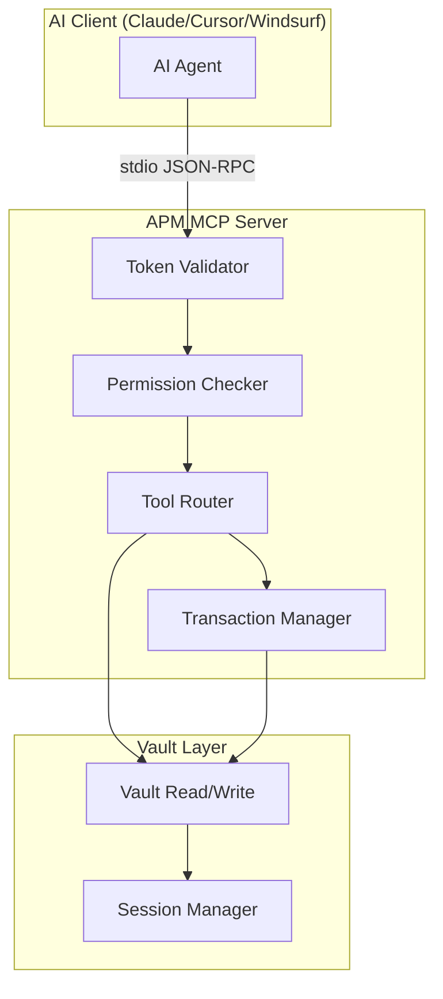
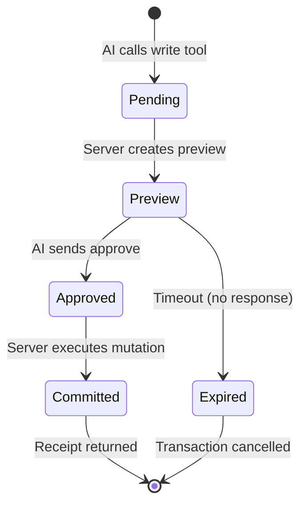

# MCP Server

APM includes a native **Model Context Protocol (MCP)** server that enables AI assistants to interact with your encrypted vault through a standardized tool-calling interface.

---

## Architecture



### Transport

The MCP server uses **stdio transport** — it reads JSON-RPC messages from stdin and writes responses to stdout. It's spawned as a subprocess by the AI client.

---

## Permission Scopes

Each token has one or more permission scopes that control tool access:

| Scope     | Tools Available                                                                                         |
| :-------- | :------------------------------------------------------------------------------------------------------ |
| `read`    | `list_entries`, `search_entries`, `get_entry` (metadata only)                                           |
| `secrets` | All `read` tools + `decrypt_entry` (password values), `get_totp`                                        |
| `write`   | All `read` + `add_entry`, `edit_entry`, `delete_entry`, `manage_spaces`, `install_plugin`, `cloud_sync` |
| `admin`   | All scopes + `manage_profiles`, `cloud_config`, `get_history`, `get_audit_logs`                         |

Scopes are **cumulative** — `admin` includes everything from `write`, which includes everything from `read`.

---

## Transaction Guardrails

All write operations use a **two-phase commit** to prevent unintended changes:

### Phase 1: Preview

When the AI calls a write tool (e.g., `add_entry`), APM:

1. Creates a **preview** of the change
2. Generates a unique `tx_id`
3. Returns the preview to the AI for review

### Phase 2: Commit

The AI must send a second call with:

- The same `tx_id`
- An explicit `approve: true` flag

Only then does APM execute the mutation and return a **receipt ID**.



### Why Guardrails?

AI agents can make mistakes. Transaction guardrails ensure:

- **No accidental mutations** — Every change requires explicit approval
- **Audit trail** — Each transaction generates a receipt ID
- **Reversibility** — The preview phase lets the AI (or user) catch errors

---

## Token Lifecycle

### Creation

```bash
pm mcp token
```

Creates a token with:

- A human-readable **name** for identification
- Selected **permission scopes**
- Optional **expiry duration**
- A **hashed copy** stored in the vault (the plaintext token is shown only once)

### Storage

Tokens are stored as an array within the encrypted vault:

```json
{
  "mcp_tokens": [
    {
      "name": "claude-desktop",
      "token_hash": "sha256:...",
      "permissions": ["read", "secrets"],
      "created_at": "2026-01-15T10:00:00Z",
      "last_used": "2026-01-16T08:30:00Z",
      "use_count": 42,
      "expires_at": "2026-02-15T10:00:00Z"
    }
  ]
}
```

### Validation

On every request:

1. Extract the bearer token from the `--token` flag
2. Hash the provided token with SHA-256
3. Compare against stored token hashes
4. Check expiry
5. Verify scope permits the requested tool

### Revocation

```bash
pm mcp revoke "claude-desktop"
```

Removes the token entry from the vault. The token is immediately rejected on subsequent requests.

---

## Session Integration

The MCP server requires an active APM session to access vault data:

- **Regular session** — The MCP server uses the same session as the CLI (`pm unlock`)
- **Ephemeral session** — Set `APM_EPHEMERAL_ID` for host/PID/agent-bound delegation

!!! tip
    For production deployments, use ephemeral sessions with host binding to restrict MCP access to the specific machine running the AI client.

---

## Next Steps

- **[MCP Tools Reference](../reference/mcp-tools.md)** — All tool schemas and permissions
- **[MCP Integration Guide](../guides/mcp-integration.md)** — Setup for Claude, Cursor, Windsurf