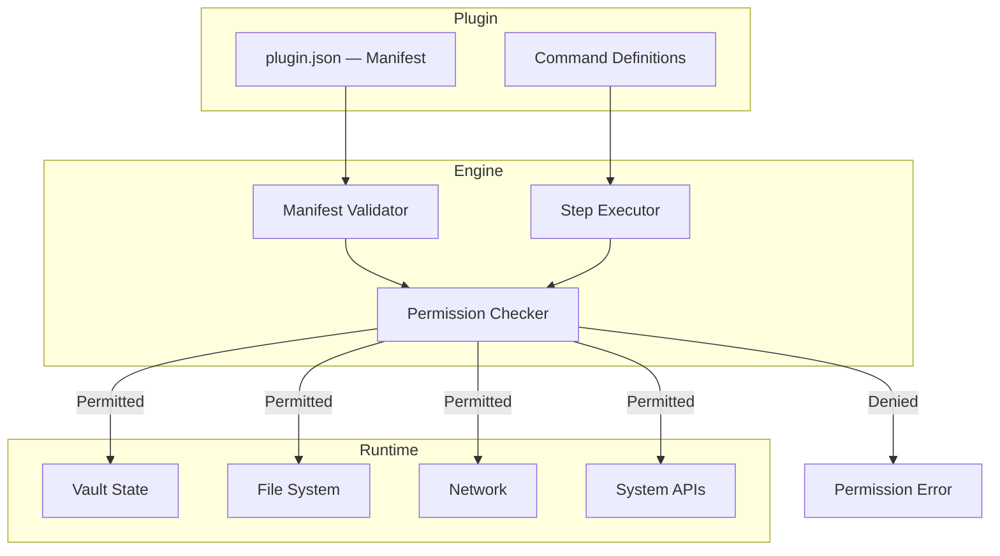
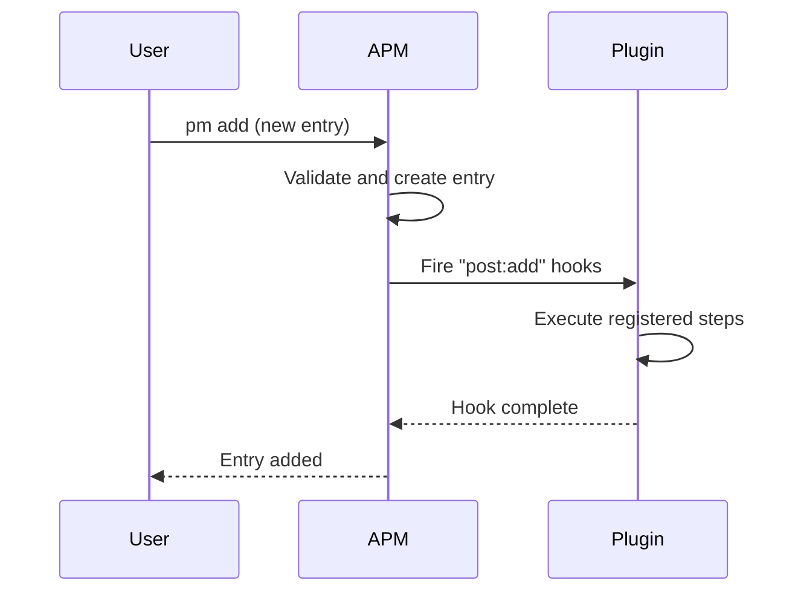

# Plugins

APM features a manifest-based plugin architecture that allows third-party extensions to interact with the vault, hook into lifecycle events, and register custom commands — all within a strict permission boundary.

---

## Architecture



---

## Manifest Format

Every plugin is a directory containing a `plugin.json` manifest:

```json
{
  "name": "my_plugin",
  "version": "1.2.0",
  "description": "A plugin that does something useful",
  "author": "Developer Name",
  "permissions_required": [
    "vault.read",
    "vault.write",
    "file.storage"
  ],
  "allowed_file_types": [".json", ".txt", ".csv"],
  "commands": ["backup", "restore", "analyze"],
  "hooks": ["post:add", "pre:sync"]
}
```

### Validation Rules

Manifests are validated against strict rules:

- `name` — Required, non-empty
- `version` — Must follow semantic versioning (`X.Y.Z` with optional pre-release)
- `permissions_required` — Must only contain known permission strings (or wildcard patterns like `vault.*`)
- `hooks` — Must follow the `pre:command` or `post:command` pattern

---

## Permission System

APM uses a **granular, hierarchical permission system** with **100+ individual permissions** organized across 14 domains. Plugins must declare their required permissions, and APM enforces them at runtime for every step execution.

### Vault Permissions (`vault.*`)

Core vault-level operations:

| Permission      | Description                       |
| :-------------- | :-------------------------------- |
| `vault.read`    | Read vault entries and metadata   |
| `vault.write`   | Write/modify vault entries        |
| `vault.delete`  | Delete vault entries              |
| `vault.import`  | Import data into the vault        |
| `vault.export`  | Export data from the vault        |
| `vault.backup`  | Create vault backups              |
| `vault.restore` | Restore from vault backups        |
| `vault.history` | Access vault modification history |
| `vault.lock`    | Lock the vault                    |
| `vault.unlock`  | Unlock the vault                  |
| `vault.sync`    | Trigger cloud synchronization     |

### Vault Item Permissions (`vault.item.*`)

CRUD operations on individual entries:

| Permission          | Description                  |
| :------------------ | :--------------------------- |
| `vault.item.create` | Create new vault entries     |
| `vault.item.read`   | Read existing entries        |
| `vault.item.update` | Update existing entries      |
| `vault.item.delete` | Delete entries               |
| `vault.item.move`   | Move entries between spaces  |
| `vault.item.copy`   | Copy entries                 |
| `vault.item.share`  | Share entries (team edition) |

### Vault Field Permissions (`vault.item.field.*`)

Fine-grained field-level access control:

| Permission                        | Description           |
| :-------------------------------- | :-------------------- |
| `vault.item.field.password.read`  | Read password fields  |
| `vault.item.field.password.write` | Write password fields |
| `vault.item.field.username.read`  | Read username fields  |
| `vault.item.field.username.write` | Write username fields |
| `vault.item.field.url.read`       | Read URL fields       |
| `vault.item.field.url.write`      | Write URL fields      |
| `vault.item.field.notes.read`     | Read note content     |
| `vault.item.field.notes.write`    | Write note content    |
| `vault.item.field.totp.read`      | Read TOTP secrets     |
| `vault.item.field.totp.write`     | Write TOTP secrets    |
| `vault.item.field.tags.read`      | Read entry tags       |
| `vault.item.field.tags.write`     | Write entry tags      |
| `vault.item.field.metadata.read`  | Read entry metadata   |
| `vault.item.field.metadata.write` | Write entry metadata  |
| `vault.item.field.custom.read`    | Read custom fields    |
| `vault.item.field.custom.write`   | Write custom fields   |

### Network Permissions (`network.*`)

Outbound and inbound network access:

| Permission         | Description                     |
| :----------------- | :------------------------------ |
| `network.outbound` | General outbound network access |
| `network.inbound`  | Accept inbound connections      |
| `network.http`     | HTTP requests                   |
| `network.https`    | HTTPS requests                  |
| `network.ftp`      | FTP connections                 |
| `network.sftp`     | SFTP connections                |
| `network.ssh`      | SSH connections                 |
| `network.ws`       | WebSocket connections           |
| `network.wss`      | Secure WebSocket connections    |
| `network.tcp`      | Raw TCP connections             |
| `network.udp`      | UDP connections                 |
| `network.icmp`     | ICMP (ping)                     |
| `network.proxy`    | Proxy connections               |
| `network.dns`      | DNS queries                     |
| `network.api.rest` | REST API calls                  |
| `network.api.grpc` | gRPC API calls                  |

### System Permissions (`system.*`)

OS-level operations:

| Permission               | Description                |
| :----------------------- | :------------------------- |
| `system.read`            | Read system information    |
| `system.write`           | Write system files         |
| `system.exec`            | Execute system commands    |
| `system.env.read`        | Read environment variables |
| `system.env.write`       | Set environment variables  |
| `system.process.read`    | Read process information   |
| `system.process.write`   | Modify processes           |
| `system.process.kill`    | Kill processes             |
| `system.clipboard.read`  | Read from clipboard        |
| `system.clipboard.write` | Write to clipboard         |
| `system.notification`    | Show system notifications  |
| `system.audio.record`    | Record audio               |
| `system.audio.play`      | Play audio                 |
| `system.camera`          | Access camera              |
| `system.location`        | Access location services   |
| `system.power`           | Control power state        |
| `system.usb.read`        | Read USB devices           |
| `system.usb.write`       | Write to USB devices       |
| `system.bluetooth`       | Access Bluetooth           |
| `system.wifi`            | Access Wi-Fi interfaces    |

### Cryptography Permissions (`crypto.*`)

Cryptographic operations:

| Permission             | Description                 |
| :--------------------- | :-------------------------- |
| `crypto.use`           | General cryptography access |
| `crypto.hash`          | Compute hashes              |
| `crypto.random`        | Generate random data        |
| `crypto.encrypt`       | Encrypt data                |
| `crypto.decrypt`       | Decrypt data                |
| `crypto.sign`          | Create digital signatures   |
| `crypto.verify`        | Verify digital signatures   |
| `crypto.key.generate`  | Generate cryptographic keys |
| `crypto.key.store`     | Store keys                  |
| `crypto.key.load`      | Load stored keys            |
| `crypto.key.delete`    | Delete stored keys          |
| `crypto.cert.generate` | Generate certificates       |
| `crypto.cert.validate` | Validate certificates       |

### File Storage (`file.*`)

| Permission     | Description                                      |
| :------------- | :----------------------------------------------- |
| `file.storage` | Read/write files (limited to allowed file types) |

### Plugin Management (`plugin.*`)

| Permission            | Description                |
| :-------------------- | :------------------------- |
| `plugin.list`         | List installed plugins     |
| `plugin.install`      | Install plugins            |
| `plugin.uninstall`    | Remove plugins             |
| `plugin.update`       | Update plugins             |
| `plugin.config.read`  | Read plugin configuration  |
| `plugin.config.write` | Write plugin configuration |
| `plugin.reload`       | Reload plugin state        |

### UI Permissions (`ui.*`)

User interface interactions:

| Permission           | Description               |
| :------------------- | :------------------------ |
| `ui.prompt`          | Show user prompts         |
| `ui.alert`           | Show alert dialogs        |
| `ui.confirm`         | Show confirmation dialogs |
| `ui.toast`           | Show toast notifications  |
| `ui.dialog`          | Show custom dialogs       |
| `ui.window.open`     | Open windows              |
| `ui.window.close`    | Close windows             |
| `ui.window.maximize` | Maximize windows          |
| `ui.window.minimize` | Minimize windows          |
| `ui.menu.add`        | Add menu items            |
| `ui.menu.remove`     | Remove menu items         |
| `ui.theme.set`       | Change UI theme           |
| `ui.font.set`        | Change UI font            |

### User & Session Permissions (`user.*`)

| Permission           | Description                     |
| :------------------- | :------------------------------ |
| `user.read`          | Read user information           |
| `user.write`         | Modify user information         |
| `user.auth`          | Trigger authentication          |
| `user.session.read`  | Read session data               |
| `user.session.write` | Modify session data             |
| `user.profile.read`  | Read user profile               |
| `user.profile.write` | Modify user profile             |
| `user.biometric`     | Access biometric authentication |

### Audit Permissions (`audit.*`)

| Permission         | Description            |
| :----------------- | :--------------------- |
| `audit.read`       | Read audit data        |
| `audit.write`      | Write audit entries    |
| `audit.log.read`   | Read audit logs        |
| `audit.log.write`  | Write to audit logs    |
| `audit.alert.read` | Read audit alerts      |
| `audit.report`     | Generate audit reports |

### Database Permissions (`db.*`)

| Permission        | Description                |
| :---------------- | :------------------------- |
| `db.read`         | Read internal database     |
| `db.write`        | Write to internal database |
| `db.query`        | Execute database queries   |
| `db.schema.read`  | Read database schema       |
| `db.schema.write` | Modify database schema     |

### AI / ML Permissions (`ai.*`)

| Permission      | Description           |
| :-------------- | :-------------------- |
| `ai.model.load` | Load ML models        |
| `ai.predict`    | Run model predictions |
| `ai.train`      | Train models          |

### IoT / Hardware Permissions (`iot.*`)

| Permission    | Description            |
| :------------ | :--------------------- |
| `iot.scan`    | Scan for IoT devices   |
| `iot.connect` | Connect to IoT devices |
| `iot.control` | Control IoT devices    |

### Cloud Permissions (`cloud.*`)

| Permission           | Description                |
| :------------------- | :------------------------- |
| `cloud.sync`         | Trigger cloud sync         |
| `cloud.backup`       | Create cloud backups       |
| `cloud.restore`      | Restore from cloud         |
| `cloud.config.read`  | Read cloud configuration   |
| `cloud.config.write` | Modify cloud configuration |

### Wildcard Permissions

Plugins can request wildcard access to entire categories using the `.*` suffix:

```json
"permissions_required": ["vault.*", "network.*", "system.*"]
```

This grants **all permissions** within the specified category. Use with caution — prefer specific permissions when possible.

### Runtime Overrides

Users can override plugin permissions using the interactive `pm plugins access` command — selectively enabling or disabling specific permissions for installed plugins. Overrides are stored in the encrypted vault and travel with it across devices via cloud sync.

---

## Step Executor

The step executor runs plugin command pipelines. Each command is defined as a sequence of steps:

| Step Type        | Description                     |
| :--------------- | :------------------------------ |
| `vault.read`     | Read entries from the vault     |
| `vault.write`    | Write entries to the vault      |
| `vault.delete`   | Delete entries                  |
| `file.read`      | Read a file from the filesystem |
| `file.write`     | Write a file                    |
| `exec`           | Execute a system command        |
| `http`           | Make an HTTP request            |
| `crypto.hash`    | Compute a hash                  |
| `crypto.encrypt` | Encrypt data                    |
| `set`            | Set a variable                  |
| `print`          | Output text                     |
| `prompt`         | Ask the user for input          |

Steps support **variable substitution** — output from one step can feed into subsequent steps using `${variable_name}` syntax.

---

## Hook System

Plugins can register hooks that fire during vault lifecycle events:



Hooks are called in order of plugin registration. If a `pre:` hook fails, the operation is aborted.

---

## Marketplace

Plugins are distributed via the cloud-backed marketplace:

```bash
pm plugins market          # Browse all available plugins
pm plugins search <query>  # Search the marketplace
pm plugins install <name>  # Install from marketplace
pm plugins push <name>     # Publish to marketplace
```

The marketplace stores plugin bundles on the same cloud providers used for vault sync.

---

## Next Steps

- **[Plugin API Reference](../reference/plugin-api.md)** — Full permission catalog and step commands
- **[Using Plugins Guide](../guides/plugins.md)** — Installation and management