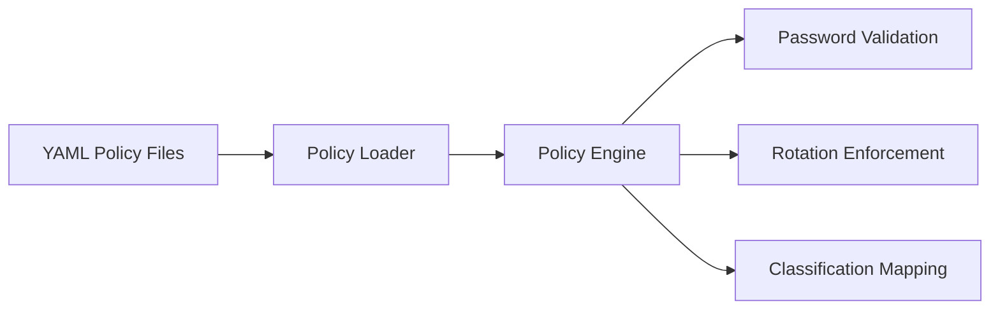

# Policy Engine

APM includes a YAML-based policy engine that enforces security standards for password complexity, rotation schedules, and classification levels. Policies are loaded from files and applied automatically during entry creation and modification.

---

## Overview

The policy engine consists of three components:



---

## Policy File Format

Policies are defined in YAML files:

```yaml
name: corporate-standard
description: Standard corporate password policy

password_policy:
  min_length: 14
  require_uppercase: true
  require_numbers: true
  require_symbols: true

rotation_policy:
  rotate_every_days: 90
  notify_before_days: 14

classification:
  production_db: critical
  staging_api: elevated
  dev_secrets: normal
```

---

## Password Policy

The `password_policy` section enforces complexity requirements:

| Field               | Type   | Default | Description                    |
| :------------------ | :----- | :------ | :----------------------------- |
| `min_length`        | `int`  | 8       | Minimum password length        |
| `require_uppercase` | `bool` | false   | Must contain uppercase letter  |
| `require_numbers`   | `bool` | false   | Must contain digit             |
| `require_symbols`   | `bool` | false   | Must contain special character |

When a policy is active, APM validates new passwords during `pm add` and during entry edits performed from the interactive `pm get` browser:

- **Pass** — Password meets all requirements
- **Fail** — APM shows which requirements are not met and asks for a new password

---

## Rotation Policy

The `rotation_policy` section enforces credential rotation schedules:

| Field                | Type  | Default | Description                     |
| :------------------- | :---- | :------ | :------------------------------ |
| `rotate_every_days`  | `int` | 0       | Days between required rotations |
| `notify_before_days` | `int` | 0       | Days before due date to notify  |

When rotation is enforced:

- `pm health` includes rotation status in the health score
- `pm trust` penalizes secrets that haven't been rotated on schedule
- APM can display warnings for secrets approaching their rotation date

---

## Classification

The `classification` section maps entry names to privilege levels:

```yaml
classification:
  aws_root: critical
  prod_database: critical
  staging_api: elevated
  dev_token: normal
```

Classification levels affect trust scoring:

| Level      | Trust Penalty | Description                   |
| :--------- | :------------ | :---------------------------- |
| `critical` | −15           | Highest-privilege credentials |
| `root`     | −15           | Root-level access             |
| `admin`    | −12           | Administrative access         |
| `elevated` | −8            | Above-normal access           |
| `normal`   | 0             | Standard credentials          |

---

## Loading Policies

```bash
pm policy load ./policies/
```

Loads all YAML files from the specified directory. APM merges multiple policy files, with later files overriding earlier ones for conflicting keys.

!!! info "No Persistent Storage"
    Policies are loaded per-session. They are not stored in the vault. To apply policies consistently, load them at the start of each session or automate via scripting.

---

## Example Policy Files

### Enterprise Standard

```yaml
name: enterprise-standard
password_policy:
  min_length: 16
  require_uppercase: true
  require_numbers: true
  require_symbols: true
rotation_policy:
  rotate_every_days: 60
  notify_before_days: 14
classification:
  aws_root: critical
  production_db: critical
  staging_key: elevated
```

### Developer Team

```yaml
name: dev-team
password_policy:
  min_length: 12
  require_uppercase: true
  require_numbers: true
  require_symbols: false
rotation_policy:
  rotate_every_days: 180
  notify_before_days: 30
```

---

## Next Steps

- **[Policies Reference](../reference/policies.md)** — Full YAML schema specification
- **[Trust Scoring](../guides/vault-management.md#trust-scores)** — How classification affects trust
