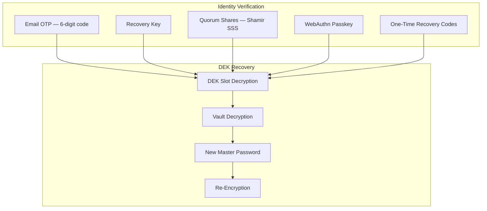
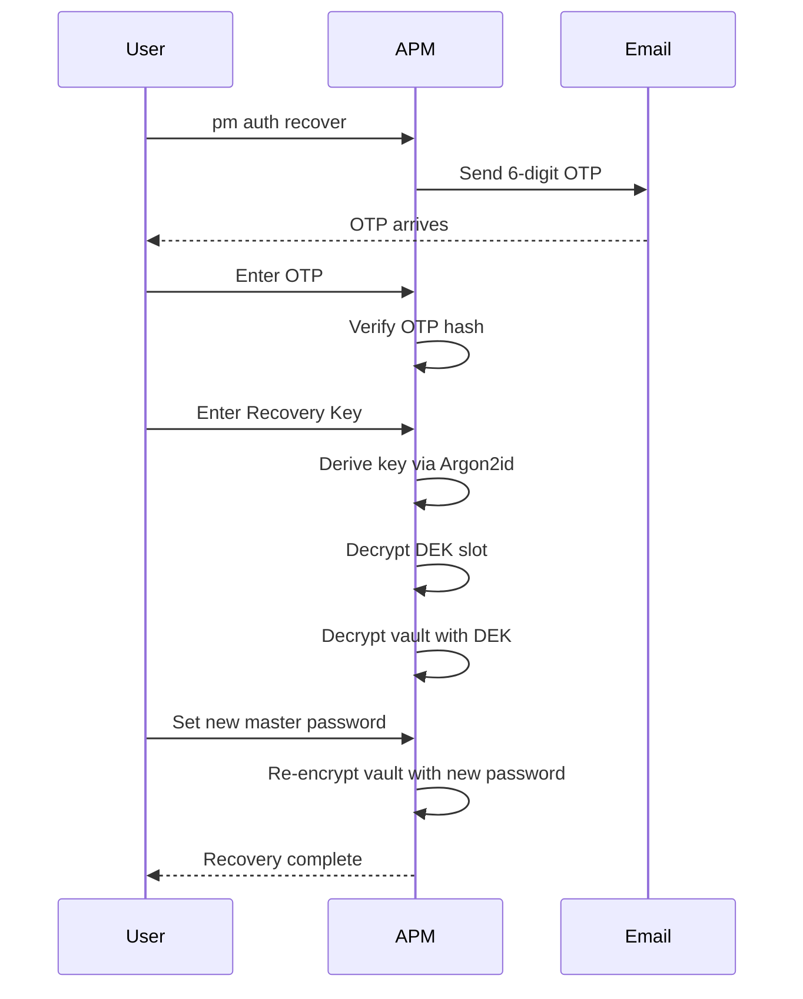

# Recovery

APM provides a multi-layered recovery system that enables vault access restoration without compromising zero-knowledge guarantees. Your master password is never stored or transmitted — recovery works by unlocking a **Data Encryption Key (DEK) slot** through verified identity.

---

## Recovery Architecture



---

## Recovery Flow

The standard recovery flow uses **multi-step identity verification**:



---

## Factor 1: Email OTP

### Setup

```bash
pm auth email user@example.com
```

APM stores a **hash** of the email address in the vault — not the plaintext email. This preserves zero-knowledge while enabling OTP delivery.

### OTP Generation

During recovery, APM:

1. Generates a 6-digit code using `crypto/rand`
2. Hashes the code with SHA-256 and stores it in the vault with an expiry timestamp
3. Sends the code via SMTP (using `gopkg.in/gomail.v2`)
4. Verifies the user's input against the stored hash

!!! info
    Tokens expire quickly and are single-use. A failed verification increments the attempt counter; excessive failures may require cooldown.

---

## Factor 2: Recovery Key

### Setup

The recovery key is generated during vault initialization or via `pm auth` commands:

```bash
pm auth recover  # Initiates recovery setup
```

### How It Works

1. APM generates a **32-byte recovery key** using `crypto/rand`
2. The key is encoded as a human-readable hex string
3. A **DEK slot** is created: the vault's encryption key is encrypted using a key derived from the recovery key via Argon2id
4. The recovery key hash and salt are stored in the vault
5. The recovery key itself is displayed once and must be stored securely by the user

### XOR Obfuscation

For additional protection during transport, recovery keys can be XOR-obfuscated with a random mask:

```
obfuscated = recovery_key ⊕ random_mask
```

The mask is stored alongside the obfuscated key. De-obfuscation requires both components.

### Verification

During recovery:

1. User provides the recovery key
2. APM derives an encryption key from it using Argon2id with the stored salt
3. Computes SHA-256 hash and compares against stored hash
4. If valid, decrypts the DEK slot to obtain the vault encryption key
5. Decrypts the vault using the recovered encryption key

---

## Factor 3: Quorum Recovery (Shamir Secret Sharing)

For high-security environments, APM supports **Shamir's Secret Sharing** to distribute the recovery key across multiple trustees.

### Setup

```bash
pm auth quorum-setup
```

You configure:

- **Total shares** (N) — How many shares to create
- **Threshold** (K) — How many shares are needed to reconstruct

For example, 5 shares with a threshold of 3 means any 3 of the 5 trustees can recover the key.

### Mathematics

Shamir's Secret Sharing uses polynomial interpolation over a finite field (GF(2^8)):

1. The recovery key S is treated as a set of bytes
2. A random polynomial P(x) of degree K−1 is generated with P(0) = S
3. N points on the polynomial are computed: (1, P(1)), (2, P(2)), ..., (N, P(N))
4. Each point is a share distributed to a trustee

To reconstruct, any K shares are used with **Lagrange interpolation** to recover P(0) = S.

### Security Properties

- Any K−1 or fewer shares reveal **zero information** about the secret
- Each share is individually worthless
- Share hashes are stored in the vault for verification

---

## Factor 4: WebAuthn Passkeys

### Setup

```bash
pm auth passkey register
```

APM starts a local WebAuthn ceremony:

1. A browser opens for passkey registration
2. The user authenticates with their platform authenticator (fingerprint, face, or security key)
3. APM stores the credential public key and user handle in the vault
4. The passkey can be used as an additional factor during recovery

### Verification

During recovery, APM starts a WebAuthn authentication ceremony. The user must prove possession of the private key corresponding to the stored credential.

---

## Factor 5: One-Time Recovery Codes

### Generation

```bash
pm auth codes generate
```

APM generates a set of **one-time use codes** (typically 10):

```
ABC12-DEF34
GHI56-JKL78
MNO90-PQR12
...
```

### Properties

- Each code can be used **exactly once**
- Codes are stored as SHA-256 hashes in the vault
- Used codes are marked and cannot be reused
- Codes never expire (but can be regenerated)

---

## Security Level

APM supports three security levels that control which recovery factors are required:

```bash
pm auth level [1-3]
```

| Level | Requirements                                 |
| :---- | :------------------------------------------- |
| 1     | Email OTP only                               |
| 2     | Email OTP + Recovery Key                     |
| 3     | Email OTP + Recovery Key + Additional factor |

Higher levels require more verification steps but provide stronger assurance against unauthorized recovery.

---

## Alerts

```bash
pm auth alerts
```

Enables email alerts for security-sensitive events:

- Recovery attempts
- Failed login attempts
- Vault re-encryption
- Profile changes

---

## Zero-Knowledge Guarantee

Throughout the entire recovery process:

- The master password is **never transmitted** or stored
- Email OTP tokens are **hashed** before storage
- Recovery keys are **never stored** on any server
- Quorum shares reveal nothing individually
- Passkey private keys never leave the authenticator

---

## Next Steps

- **[Encryption](encryption.md)** — DEK slot encryption details
- **[Sessions Guide](../guides/sessions.md)** — Post-recovery session management