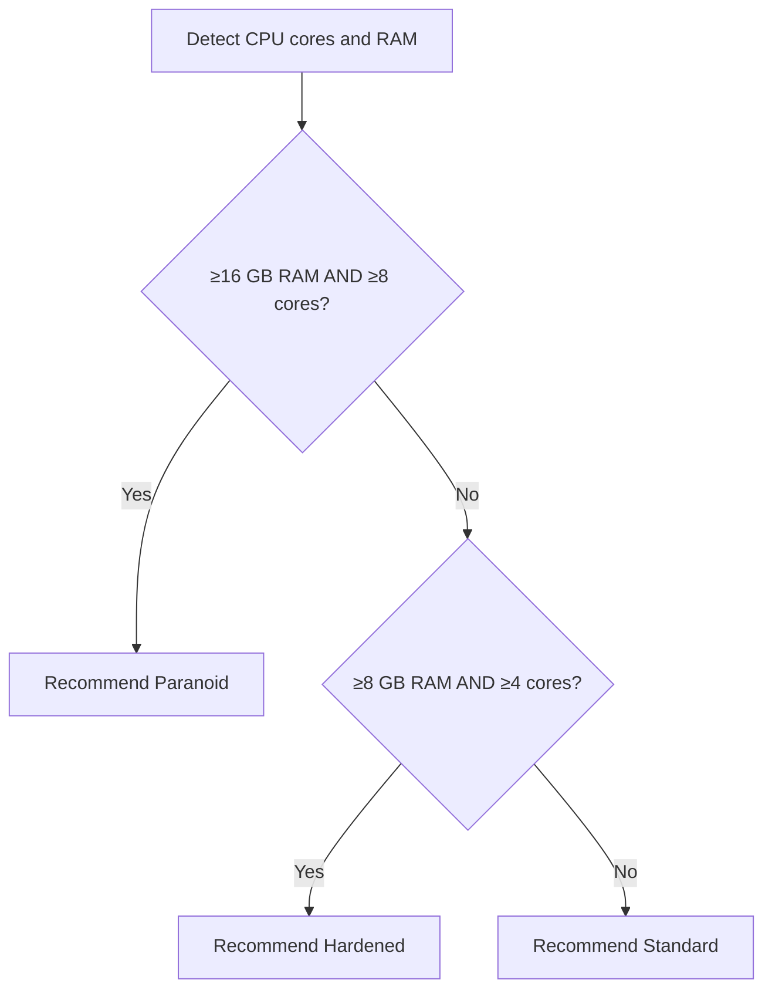

# Security Profiles

APM supports four encryption profiles that control the Argon2id key derivation parameters. Each profile represents a trade-off between performance and brute-force resistance.

---

## Profiles Comparison

| Parameter         | Standard | Hardened | Paranoid | Legacy        |
| :---------------- | :------- | :------- | :------- | :------------ |
| **Algorithm**     | Argon2id | Argon2id | Argon2id | PBKDF2-SHA256 |
| **Memory**        | 64 MB    | 256 MB   | 512 MB   | N/A           |
| **Iterations**    | 3        | 5        | 6        | 600,000       |
| **Parallelism**   | 2        | 4        | 4        | 1             |
| **Key Output**    | 96 bytes | 96 bytes | 96 bytes | 96 bytes      |
| **Salt Size**     | 16 bytes | 16 bytes | 16 bytes | 16 bytes      |
| **Min RAM**       | Any      | ≥8 GB    | ≥16 GB   | Any           |
| **Min Cores**     | Any      | ≥4       | ≥8       | Any           |
| **Decrypt Speed** | ~100ms   | ~500ms   | ~1.5s    | ~200ms        |

---

## Profile Details

### Standard (Profile ID: 0)

The default profile suitable for most machines. It uses moderate Argon2id parameters that resist commodity GPU attacks while keeping unlock times under 200ms.

!!! tip "Recommended For"
    Personal laptops, desktops, and most workstations.

### Hardened (Profile ID: 1)

Doubles the memory cost and adds parallelism for machines with ≥8 GB RAM and ≥4 CPU cores. Makes GPU/FPGA attacks significantly more expensive.

!!! tip "Recommended For"
    Developer workstations, servers used for credential management.

### Paranoid (Profile ID: 2)

Maximum security parameters for high-value vaults on powerful machines. The 512 MB memory cost makes ASIC attacks impractical.

!!! tip "Recommended For"
    Infrastructure servers, DevOps teams managing production credentials, and users with high-value secrets (SSH root keys, cloud admin credentials).

### Legacy (Profile ID: 3)

Uses PBKDF2-SHA256 instead of Argon2id for backward compatibility with older APM vault formats. This profile is **not recommended** for new vaults.

!!! warning
    PBKDF2 is significantly weaker against GPU attacks compared to Argon2id. Use this only if you need to interoperate with pre-V3 vaults.

---

## Auto-Detection and Recommendation

During `pm init`, APM probes your system hardware and recommends the optimal profile:



The recommendation is a suggestion only — you can choose any profile regardless of hardware.

---

## Changing Profiles

```bash
pm profile
```

This interactive command lets you:

1. View your current encryption profile and its parameters
2. Select a new profile
3. Re-encrypt your vault with the new parameters

!!! warning "Re-encryption Required"
    Changing profiles requires re-encrypting the entire vault. You'll need to enter your master password to complete the operation.

---

## Custom Profiles

APM stores the current profile parameters in the vault under `current_profile_params`. While the four standard profiles cover most use cases, the vault format supports arbitrary Argon2id parameters.

---

## Viewing Current Profile

```bash
pm cinfo
```

Displays:

- Active profile name
- Argon2id memory, time, and parallelism values
- Nonce size
- Vault format version

---

## Next Steps

- **[Encryption](encryption.md)** — How profiles feed into key derivation
- **[Vault Format](vault-format.md)** — Where the profile ID is stored in the file