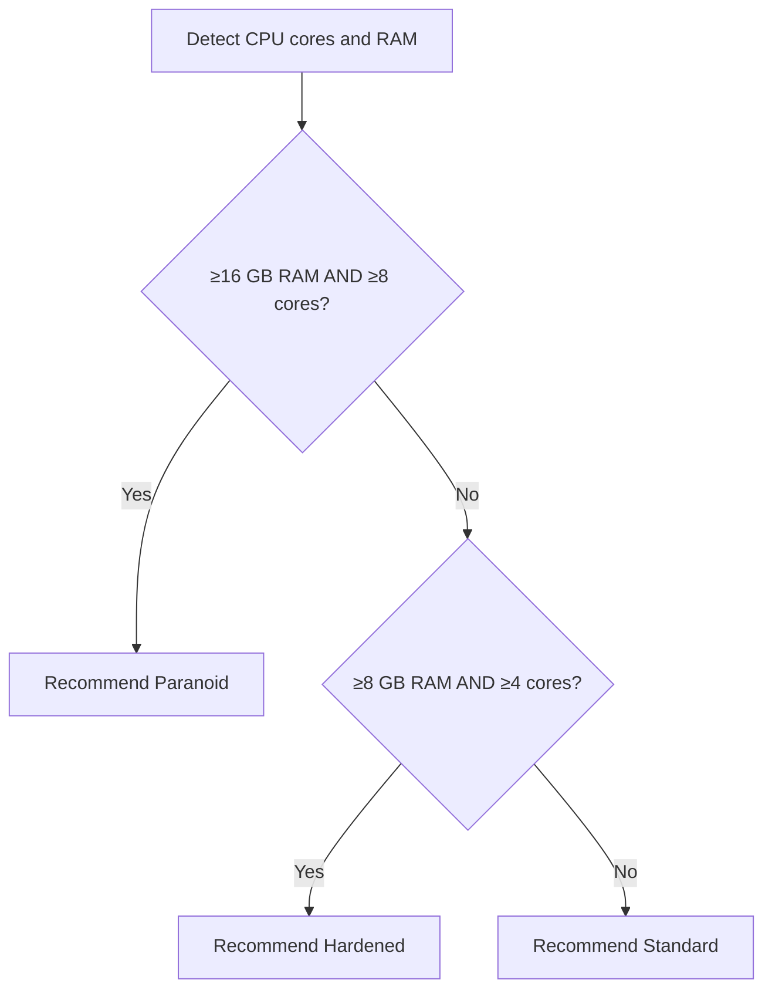

# Security Profiles

APM supports four built-in encryption profiles that control key derivation costs and default nonce sizing. Each profile represents a trade-off between performance and brute-force resistance. Profiles also carry the AEAD cipher used to encrypt the vault payload.

---

## Profiles Comparison

| Parameter         | Standard | Hardened | Paranoid | Legacy        |
| :---------------- | :------- | :------- | :------- | :------------ |
| **Algorithm**     | Argon2id | Argon2id | Argon2id | PBKDF2-SHA256 |
| **Cipher**        | AES-GCM  | AES-GCM  | AES-GCM  | AES-GCM       |
| **Memory**        | 64 MB    | 256 MB   | 512 MB   | N/A           |
| **Iterations**    | 3        | 5        | 6        | 600,000       |
| **Parallelism**   | 2        | 4        | 4        | 1             |
| **Key Output**    | 96 bytes | 96 bytes | 96 bytes | 96 bytes      |
| **Salt Size**     | 16 bytes | 32 bytes | 32 bytes | 16 bytes      |
| **Nonce Size**    | 12 bytes | 12 bytes | 24 bytes | 12 bytes      |
| **Min RAM**       | Any      | ≥8 GB    | ≥16 GB   | Any           |
| **Min Cores**     | Any      | ≥4       | ≥8       | Any           |

---

## Profile Details

### Standard

The default profile suitable for most machines. It uses moderate Argon2id parameters that resist commodity GPU attacks while keeping unlock times under 200ms.

!!! tip "Recommended For"
    Personal laptops, desktops, and most workstations.

### Hardened

Doubles the memory cost and adds parallelism for machines with ≥8 GB RAM and ≥4 CPU cores. Makes GPU/FPGA attacks significantly more expensive.

!!! tip "Recommended For"
    Developer workstations, servers used for credential management.

### Paranoid

Maximum security parameters for high-value vaults on powerful machines. The 512 MB memory cost makes ASIC attacks impractical.

!!! tip "Recommended For"
    Infrastructure servers, DevOps teams managing production credentials, and users with high-value secrets (SSH root keys, cloud admin credentials).

### Legacy

Uses PBKDF2-SHA256 instead of Argon2id for backward compatibility with older APM vault formats. This profile is **not recommended** for new vaults.

!!! warning
    PBKDF2 is significantly weaker against GPU attacks compared to Argon2id. Use this only if you need to interoperate with pre-V3 vaults.

---

## Auto-Detection and Recommendation

During `pm setup`, APM probes your system hardware and recommends the optimal profile:



The recommendation is a suggestion only — you can choose any profile regardless of hardware.

---

## Changing Profiles

APM exposes several profile commands:

```bash
pm profile list
pm profile current
pm profile set hardened
pm profile edit
pm profile create myprofile
```

These flows let you:

1. Inspect the active profile and built-in options
2. Switch to a built-in profile
3. Edit or create a custom profile
4. Re-encrypt the vault with the updated parameters

!!! warning "Re-encryption Required"
    Changing profiles requires re-encrypting the entire vault. You'll need to enter your master password to complete the operation.

---

## Custom Profiles

APM stores the current profile parameters in the vault header and keeps the active selection in the vault data. Custom profiles can change:

- KDF cost values
- Salt length
- Nonce length
- Encryption method (`aes-gcm` or `xchacha20-poly1305`)

---

## Viewing Current Profile

```bash
pm cinfo
```

Displays:

- Active profile name
- Active cipher
- Argon2id memory, time, and parallelism values
- Nonce size
- Vault format version

---

## Next Steps

- **[Encryption](encryption.md)** — How profiles feed into key derivation
- **[Vault Format](vault-format.md)** — Where the profile metadata is stored in the file
