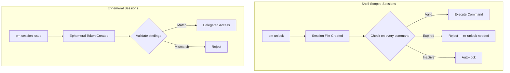
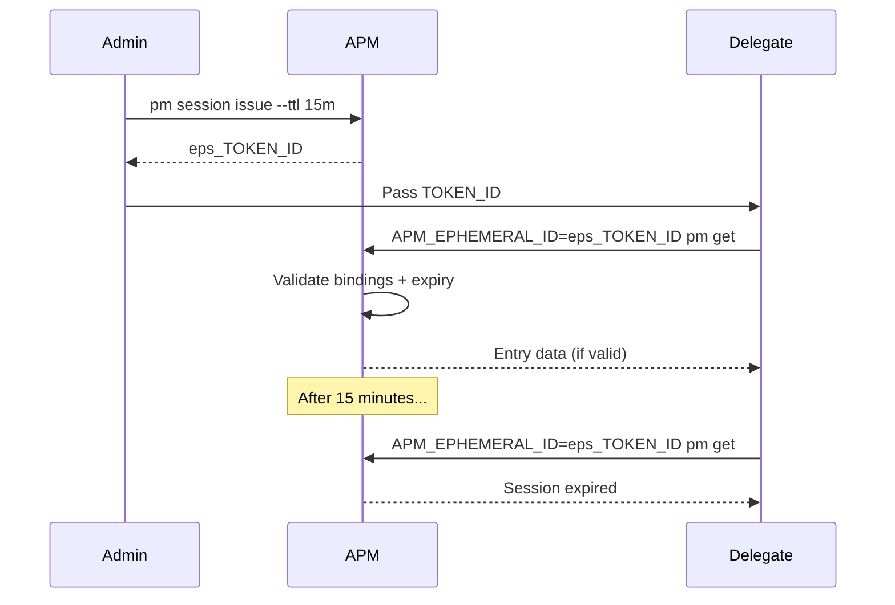

# Sessions

Sessions in APM are **time-bounded unlock windows** that control when decrypted vault data is accessible. They form the primary security boundary between encrypted-at-rest vault storage and in-memory access.

---

## Session Model



---

## Shell-Scoped Sessions

### How They Work

1. `pm unlock` decrypts the vault and creates a **session file** containing:
    - Session ID
    - Unlock timestamp
    - Expiry timestamp
    - Inactivity timeout
    - Read-only flag
    - Hashed master password (for re-verification on sensitive operations)

2. Every sensitive command checks the session file before proceeding
3. Sessions auto-expire after the configured duration or inactivity timeout
4. `pm lock` immediately destroys the session file and wipes memory

### Session Scoping

By default, APM uses a single global session file. To run independent sessions per terminal:

```bash
export APM_SESSION_ID="terminal_1"
pm unlock  # Creates session file specific to this shell
```

Different values of `APM_SESSION_ID` produce separate session files, so multiple terminals can have independent lock/unlock states.

### Session File Location

```
$TEMP/pm_session_global.json          # Global (no APM_SESSION_ID)
$TEMP/pm_session_{SESSION_ID}.json    # Scoped
```

### Session Parameters

| Parameter          | Default | Description                   |
| :----------------- | :------ | :---------------------------- |
| Session duration   | 30 min  | Maximum session lifetime      |
| Inactivity timeout | 10 min  | Auto-lock after idle time     |
| Read-only mode     | false   | Prevents all write operations |

---

## Ephemeral Delegated Sessions

Ephemeral sessions are short-lived tokens for **delegating vault access** to external processes without sharing the master password.

### Use Cases

- **CI/CD pipelines** — Grant temporary read access for credential retrieval
- **MCP server** — Provide an AI agent with scoped vault access
- **Pair programming** — Share temporary access with a teammate

### Issuing

```bash
pm session issue \
  --label "CI Build" \
  --scope read \
  --ttl 15m \
  --bind-host \
  --bind-pid 12345 \
  --agent "github-actions"
```

### Security Bindings

Ephemeral sessions support three binding types:

| Binding   | Verification                                        |
| :-------- | :-------------------------------------------------- |
| **Host**  | SHA-256(hostname + username) must match             |
| **PID**   | Calling process ID must match the bound PID         |
| **Agent** | `APM_ACTOR` env variable must match the bound agent |

If any bound property doesn't match at validation time, the session is rejected.

### Lifecycle



### Session Store

Ephemeral sessions are stored in a JSON file:

```
$TEMP/.apm_ephemeral_sessions.json
```

The store tracks all issued sessions with their bindings, creation times, expiry, and revocation status.

### Managing Ephemeral Sessions

```bash
pm session list      # List all active sessions
pm session revoke ID # Revoke a specific session
```

---

## Session Interaction Matrix

| Feature         | Requires Session | Read-Only OK | Ephemeral OK |
| :-------------- | :--------------: | :----------: | :----------: |
| `pm get`        |        ✅         |      ✅       |      ✅       |
| `pm add`        |        ✅         |      ❌       |      ❌       |
| `pm get` edit/delete actions | ✅ | ❌ | ❌ |
| `pm totp`       |        ✅         |      ✅       |      ✅       |
| `pm cloud sync` |        ✅         |      ❌       |      ❌       |
| `pm health`     |        ✅         |      ✅       |      ✅       |
| `pm trust`      |        ✅         |      ✅       |      ✅       |
| `pm audit`      |        ❌         |      ✅       |      ✅       |
| `pm info`       |        ❌         |      ✅       |      ✅       |
| Autofill daemon |        ✅         |      ✅       |      ❌       |
| MCP server      |        ✅         |  Per token   |      ✅       |

---

## Next Steps

- **[Sessions Guide](../guides/sessions.md)** — Practical how-to guide
- **[MCP Integration](../guides/mcp-integration.md)** — Using ephemeral sessions with AI agents
