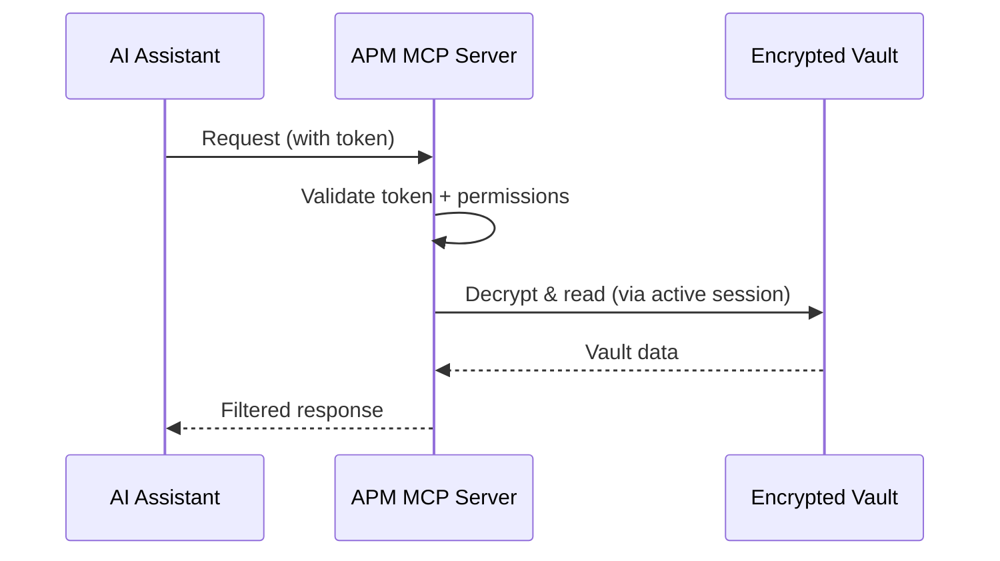
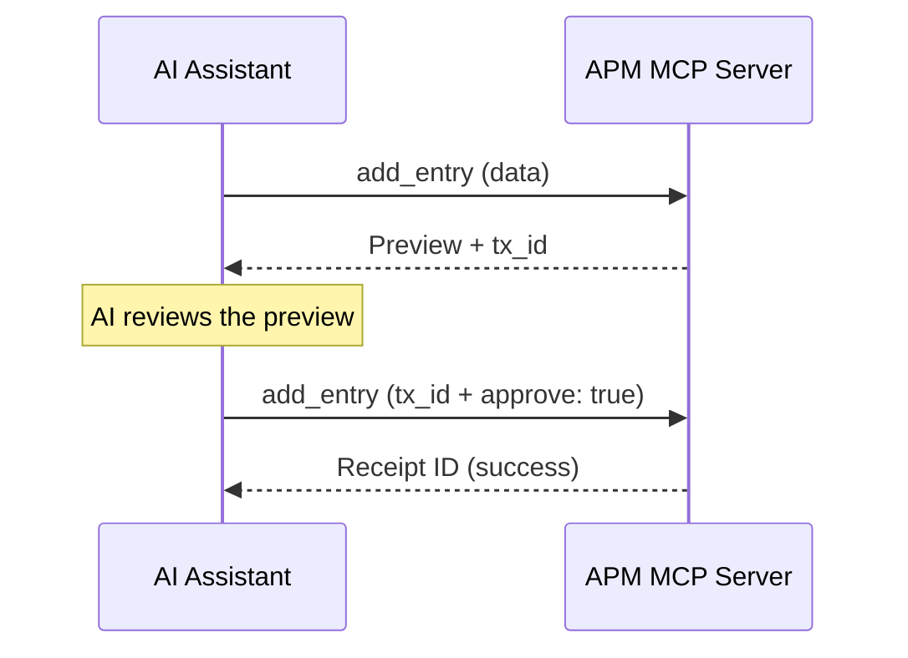

# MCP Integration

APM includes a native **Model Context Protocol (MCP)** server that lets AI assistants like Claude Desktop, Cursor, and Windsurf interact with your vault — reading entries, searching credentials, retrieving TOTP codes, and even modifying vault contents with transaction guardrails.

---

## How It Works



The MCP server runs as a subprocess spawned by the AI client. It communicates via stdio transport and requires an active APM session (or ephemeral session) to access the vault.

---

## Quick Setup

### Step 1: Generate a Token

```bash
pm mcp token
```

You'll be prompted to:

1. **Name the token** (e.g., "claude-desktop")
2. **Select permissions**:
    - `read` — List and search entries (metadata only)
    - `secrets` — Decrypt and retrieve secret values
    - `write` — Add, edit, and delete entries
    - `admin` — Manage profiles, cloud config, view history and audit logs
3. **Set expiry** (optional) — Token auto-expires after the specified duration

### Step 2: Configure Your AI Client

=== "Claude Desktop"

    Add to your `claude_desktop_config.json`:

    ```json
    {
      "mcpServers": {
        "apm": {
          "command": "C:\\path\\to\\pm.exe",
          "args": ["mcp", "serve", "--token", "YOUR_TOKEN_HERE"]
        }
      }
    }
    ```

=== "Cursor"

    Add to your MCP configuration:

    ```json
    {
      "mcpServers": {
        "apm": {
          "command": "C:\\path\\to\\pm.exe",
          "args": ["mcp", "serve", "--token", "YOUR_TOKEN_HERE"],
          "capabilities": ["tools"],
          "env": {
            "APM_VAULT_PATH": "C:\\path\\to\\vault.dat"
          }
        }
      }
    }
    ```

=== "Windsurf / Others"

    Use the same configuration format as Cursor. Adjust the binary path and vault path for your environment.

### Step 3: Unlock Your Vault

```bash
pm unlock
```

!!! important "Session Required"
    The MCP server requires an active APM session. You **must** run `pm unlock` before the AI agent can access the vault.

    Alternatively, provide an ephemeral delegated session using `APM_EPHEMERAL_ID`:

    ```bash
    pm session issue --label "mcp-claude" --scope read --ttl 1h
    # Set APM_EPHEMERAL_ID in the MCP server config
    ```

---

## Permission Scopes

Tokens have fine-grained permission scopes that control exactly what the AI agent can do:

| Scope     | Capabilities                                       | Tools                                                                                      |
| :-------- | :------------------------------------------------- | :----------------------------------------------------------------------------------------- |
| `read`    | List entries, search, view metadata                | `list_entries`, `search_entries`, `get_entry`                                              |
| `secrets` | Decrypt and retrieve secret values, get TOTP codes | `decrypt_entry`, `get_totp`                                                                |
| `write`   | Add, edit, delete entries, manage spaces           | `add_entry`, `edit_entry`, `delete_entry`, `manage_spaces`, `install_plugin`, `cloud_sync` |
| `admin`   | Manage profiles, cloud config, view history/audit  | `manage_profiles`, `cloud_config`, `get_history`, `get_audit_logs`                         |

---

## Transaction Guardrails

Write operations (`add_entry`, `edit_entry`, `delete_entry`) use a **two-step transaction model** to prevent unintended modifications:



1. **First call** — Creates a preview transaction and returns a `tx_id`
2. **AI reviews** — The AI (or user) reviews the preview
3. **Second call** — Commits the transaction by sending `tx_id` + `approve: true`
4. **Receipt** — A receipt ID is returned on successful commit

This prevents the AI from making irreversible changes without a confirmation step.

---

## Token Management

### Listing Tokens

```bash
pm mcp list
```

Shows all tokens with their names, permissions, creation dates, last usage, and usage counts.

### Revoking Tokens

```bash
pm mcp revoke "claude-desktop"
```

Revokes a token by name or token string. Revoked tokens are immediately rejected by the MCP server.

### Auto-Configuration

```bash
pm mcp config
```

Searches for known MCP client config files and offers to update them with your token automatically.

---

## Environment Variables for MCP

| Variable           | Purpose                                        |
| :----------------- | :--------------------------------------------- |
| `APM_VAULT_PATH`   | Override the vault file location               |
| `APM_EPHEMERAL_ID` | Use an ephemeral session instead of global     |
| `APM_CONTEXT`      | Set to `mcp` to indicate MCP context           |
| `APM_ACTOR`        | Identifies the actor in telemetry (e.g., `AI`) |

---

## Security Best Practices

!!! tip "Least Privilege"
    Only grant the permissions your AI agent actually needs. For most use cases, `read` is sufficient. Only add `secrets` if the AI needs to retrieve actual passwords, and `write` only if you want the AI to manage entries.

!!! warning "Token Security"
    - Store tokens securely — they grant vault access
    - Use token expiry for temporary access
    - Revoke tokens you no longer need
    - Use ephemeral sessions for additional binding (host, PID, agent)

---

## Next Steps

- **[MCP Tools Reference](../reference/mcp-tools.md)** — All tool schemas and permissions
- **[MCP Server Concepts](../concepts/mcp.md)** — Deep technical details
- **[Sessions](sessions.md)** — Ephemeral session management