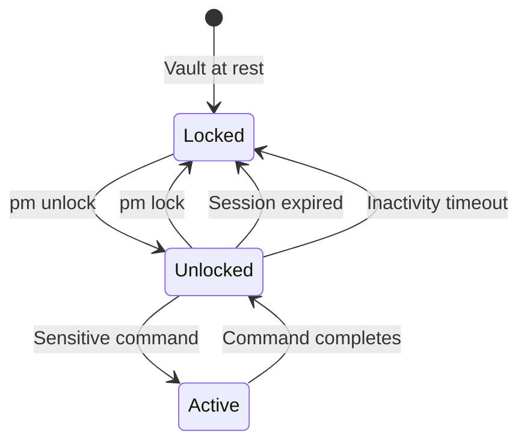

# Managing Sessions

APM uses **explicit sessions** as a security boundary — the vault is encrypted at rest and must be unlocked before any sensitive operation. Sessions prevent accidental long-term exposure of decrypted data.

---

## Session Lifecycle



### Unlocking

```bash
pm unlock
```

You are prompted for:

- **Master password**
- **Session duration** — How long before the session auto-expires (default: 30 minutes)
- **Inactivity timeout** — How long of idle time before auto-lock (default: 10 minutes)
- **Read-only mode** — Optional flag that prevents all write operations

On success, APM:

1. Decrypts the vault in memory
2. Creates a session file  in the system temp directory
3. Starts a background cleanup process that deletes the session file when expired

### Locking

```bash
pm lock
```

Immediately:

1. Deletes the session file
2. Wipes decrypted data from memory
3. Locks the autofill daemon (if running)

---

## Shell-Scoped Sessions

By default, APM uses a single global session. To run **independent sessions per terminal**, set the `APM_SESSION_ID` environment variable:

=== "Bash / Zsh"

    ```bash
    export APM_SESSION_ID="terminal1"
    pm unlock
    # This terminal has its own session
    ```

=== "PowerShell"

    ```powershell
    $env:APM_SESSION_ID = "terminal1"
    pm unlock
    ```

Each shell with a different `APM_SESSION_ID` gets its own session file and can be unlocked/locked independently.

!!! info "Session File Location"
    - **Global session**: `$TEMP/pm_session_global.json`
    - **Scoped session**: `$TEMP/pm_session_{SESSION_ID}.json`

    The session ID is sanitized to contain only alphanumeric characters.

---

## Ephemeral Delegated Sessions

Ephemeral sessions are **short-lived, context-bound tokens** that delegate vault access to another process or agent without sharing your master password directly.

### Issuing an Ephemeral Session

```bash
pm session issue --label "CI Pipeline" --scope read --ttl 15m
```

Options:

| Flag          | Description                       | Default  |
| :------------ | :-------------------------------- | :------- |
| `--label`     | Human-readable label              | (none)   |
| `--scope`     | Access scope: `read` or `write`   | `read`   |
| `--ttl`       | Time to live (e.g., `15m`, `1h`)  | Required |
| `--bind-host` | Restrict to current machine       | `false`  |
| `--bind-pid`  | Restrict to a specific process ID | (none)   |
| `--agent`     | Restrict to a specific agent name | (none)   |

The command outputs an ephemeral session ID like `eps_a1b2c3d4...`.

### Using an Ephemeral Session

Set the `APM_EPHEMERAL_ID` environment variable to use the delegated session:

```bash
export APM_EPHEMERAL_ID="eps_a1b2c3d4..."
pm get github  # Uses the ephemeral session instead of the regular one
```

### Security Bindings

Ephemeral sessions support three types of binding for additional security:

| Binding   | What It Checks                                 |
| :-------- | :--------------------------------------------- |
| **Host**  | SHA-256 hash of hostname + username must match |
| **PID**   | The calling process ID must match              |
| **Agent** | The agent name (via `APM_ACTOR`) must match    |

If a binding mismatch is detected, the session is rejected.

### Managing Ephemeral Sessions

```bash
pm session list        # List all active ephemeral sessions
pm session revoke ID   # Revoke a specific session
```

Revoked and expired sessions are automatically cleaned up.

### Use Cases

- **CI/CD pipelines** — Issue a short-lived read-only session for automated credential retrieval
- **MCP server** — Provide an ephemeral session so the AI agent doesn't need your master password
- **Pair programming** — Delegate temporary read access to a teammate's terminal

---

## How Sessions Interact with Other Features

| Feature         | Session Requirement                          |
| :-------------- | :------------------------------------------- |
| `pm add`        | Active write session (not read-only)         |
| `pm get`        | Active session (any type)                    |
| `pm edit/del`   | Active write session                         |
| `pm cloud sync` | Active session                               |
| Autofill daemon | Follows CLI session unlock/lock state        |
| MCP server      | Requires active session or ephemeral session |

---

## Next Steps

- **[MCP Integration](mcp-integration.md)** — Using ephemeral sessions with AI agents
- **[Sessions Concept](../concepts/sessions.md)** — Deep technical details