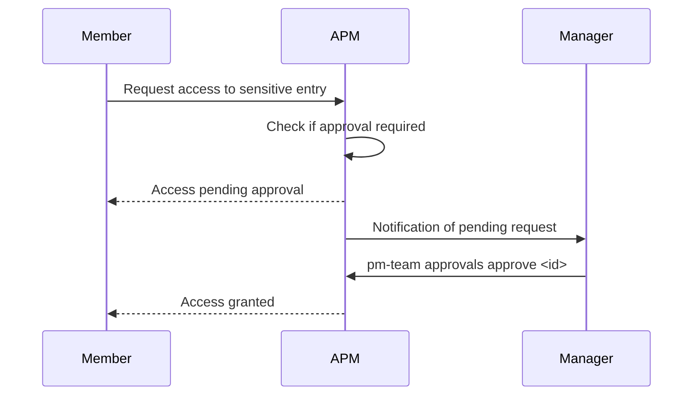

# Approval Workflows

The approval system gates access to sensitive credentials, ensuring that high-value secrets are only accessed with explicit authorization from an authorized approver.

---

## How It Works



---

## Managing Approvals

### Viewing Pending Requests

```bash
pm-team approvals list
```

Shows all pending approval requests with:

- Request ID
- Requester name and role
- Entry requested
- Timestamp
- Status

### Approving a Request

```bash
pm-team approvals approve <request_id>
```

### Denying a Request

```bash
pm-team approvals deny <request_id>
```

---

## Who Can Approve

| Role    | Can Approve |
| :------ | :---------: |
| Owner   |      ✅      |
| Admin   |      ✅      |
| Manager |      ✅      |
| Member  |      ❌      |
| Viewer  |      ❌      |

---

## Audit Trail

All approval actions (requests, approvals, denials) are recorded in the organizational audit log with:

- **Timestamp**
- **Action** (`APPROVAL_REQUESTED`, `APPROVAL_GRANTED`, `APPROVAL_DENIED`)
- **Requester**
- **Approver**
- **Entry details**