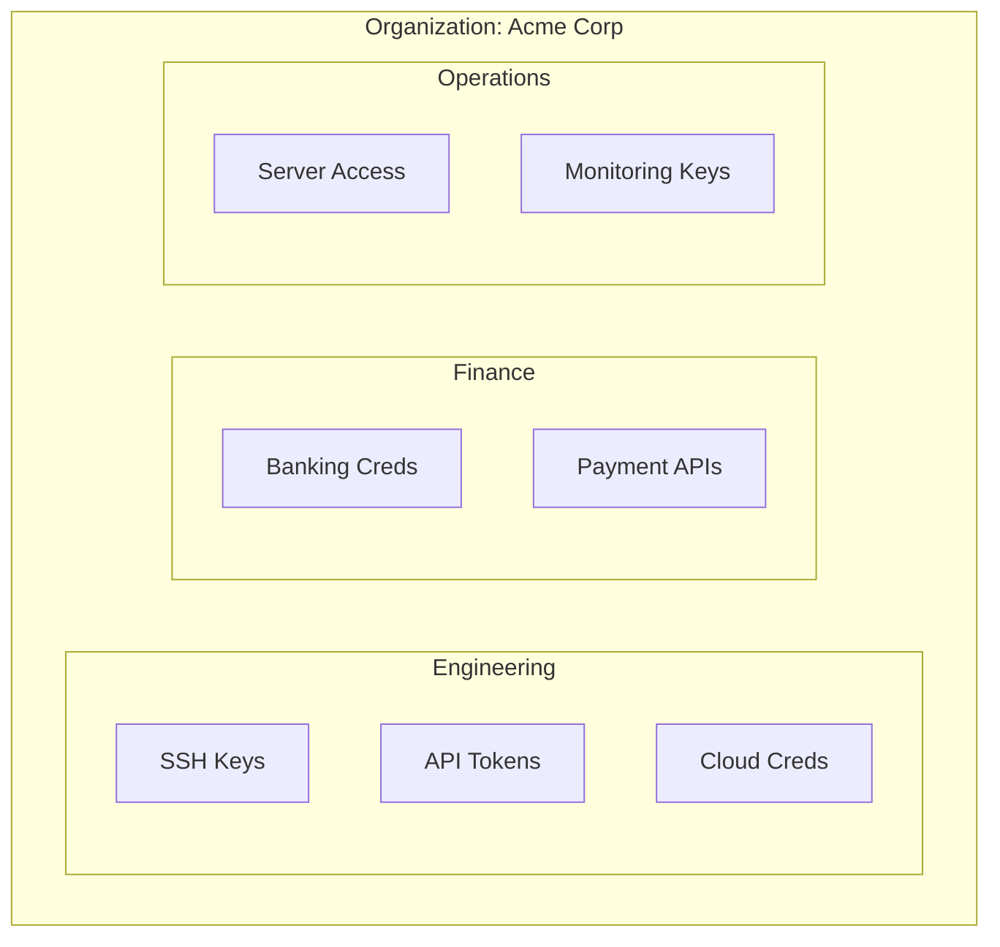

# Departments

Departments provide **isolated encryption domains** within the organization. Each department has its own encryption context, ensuring secrets in one department are cryptographically isolated from others.

---

## Creating Departments

```bash
pm-team dept create Engineering
pm-team dept create Finance
pm-team dept create Operations
```

---

## Managing Departments

```bash
# List all departments
pm-team dept list

# View department details
pm-team dept info Engineering
```

---

## Isolation Model



Each department:

- Has its own **encryption key** derived from the organizational master
- Has members who are assigned via roles
- Contains entries visible only to its members
- Maintains its own audit trail

---

## Cross-Department Access

By default, entries in one department are **invisible** to members of other departments. Cross-department access requires:

1. An **admin** or **owner** to grant it explicitly
2. Or an **approval workflow** to be triggered

This ensures that even within the same organization, credential isolation is enforced at the cryptographic level.