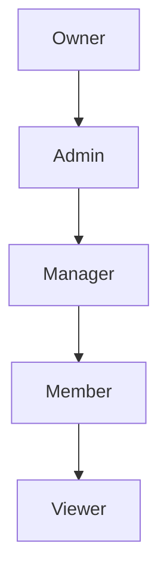

# RBAC and Roles

The Team Edition uses Role-Based Access Control (RBAC) to manage permissions across the organization.

---

## Role Hierarchy



| Role        | Capabilities                                                      |
| :---------- | :---------------------------------------------------------------- |
| **Owner**   | Full control — manage org, departments, users, all entries        |
| **Admin**   | Manage departments, users, entries within assigned departments    |
| **Manager** | Manage entries, approve access requests within department         |
| **Member**  | Read/write entries within department, request approval for others |
| **Viewer**  | Read-only access to department entries                            |

---

## Assigning Roles

```bash
# Add user with a role
pm-team user add alice --role admin --dept Engineering

# Change a user's role
pm-team user role alice manager
```

---

## Permission Matrix

| Action              | Owner | Admin | Manager | Member | Viewer |
| :------------------ | :---: | :---: | :-----: | :----: | :----: |
| Create departments  |   ✅   |   ✅   |    ❌    |   ❌    |   ❌    |
| Add users           |   ✅   |   ✅   |    ❌    |   ❌    |   ❌    |
| Assign roles        |   ✅   |   ✅   |    ❌    |   ❌    |   ❌    |
| Add entries         |   ✅   |   ✅   |    ✅    |   ✅    |   ❌    |
| Read entries        |   ✅   |   ✅   |    ✅    |   ✅    |   ✅    |
| Edit entries        |   ✅   |   ✅   |    ✅    |   ✅    |   ❌    |
| Delete entries      |   ✅   |   ✅   |    ✅    |   ❌    |   ❌    |
| Approve requests    |   ✅   |   ✅   |    ✅    |   ❌    |   ❌    |
| View audit logs     |   ✅   |   ✅   |    ✅    |   ❌    |   ❌    |
| Manage cloud config |   ✅   |   ✅   |    ❌    |   ❌    |   ❌    |